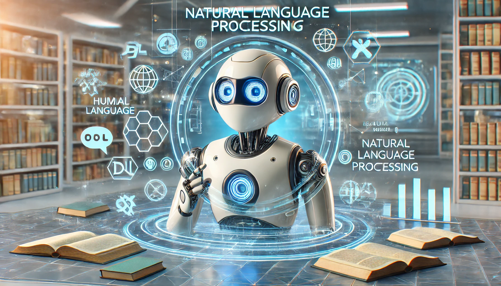

# Natural Language Processing
Natural Language Processing is a machine learning technology that gives computers the ability to interpret manipulate and comprehend human language.

# What this repository contains
### [Building Chatbots](./Chatbots/)
Building different kinds of chatbot like **rule based chatbot**, **intent based chatbot**, **slot filling chatbot**, **generative chatbot** and **Modern RAG based chatbot**.

### [Text Classification](./Classification/)
Text classification using different Machine Learning Technique like traditional machine learning algorith, MLP, RNNs and modern Transformer based model like BERT.

### [LSTM Neural Network Architecture](./LSTM/)
Using LSTM network for different task e.g language modeling, text classification, question answering, summarizatino.

### [NLP with NLTK library](./NLTK/)
Library for text processing.

### [Sequence to Sequence Learning](./Seq%20to%20Seq/)
Sequence to Sequence Learning for different variable length sequential task.

### [Text Representation](./Text%20Representation/)
Different text representation techniques like bow, embedding, one hot encoding, tfidf, etc.