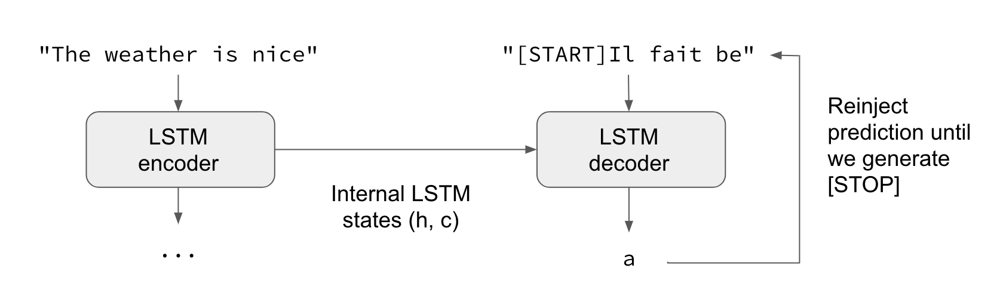

## LSTM Encoder Decoder Architecture

## In LSTM there are 3 important parameters:

1. **UNITS** : Dimensionality of the output space
2. **Return Sequences** : Whether to return the last output only or the intermediate state at each `timestep`.
3. **Return State** : Whether to return the last state in addition to the output.

So According to these, there are several behaviour LSTM can behave

1. Default: Last Hidden State as Output

2. Return Sequences=True: All Hidden State output

3. Return State = True: Last Hidden State + Last Hidden State(again) + Last Cell State

4. Return Sequence and Return State both true: All Hidden States(from each timestep) + Last Hidden State(only last timestep) + Last Cell State(of last timestep)

## This kind of Model is useful in task like `**Machine Translation**`

